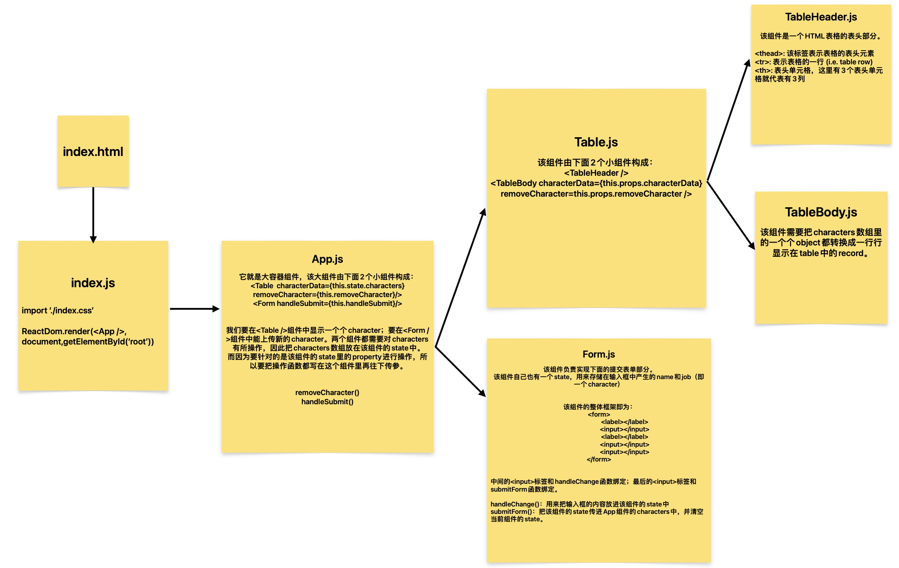

# React Tutorial

Build a very simple React app that demonstrates the some fundamental concepts of React including components, state, props, and submitting form data.

## Structure

[**View App Demo**](https://linj7.github.io/react-tutorial/)

## REFERENCE

[React Tutorial: An Overview and Walkthrough | Tania Rascia](https://www.taniarascia.com/getting-started-with-react/)
